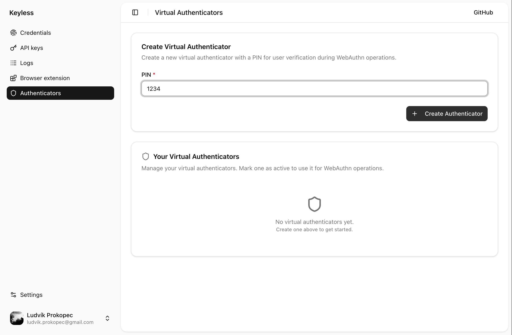
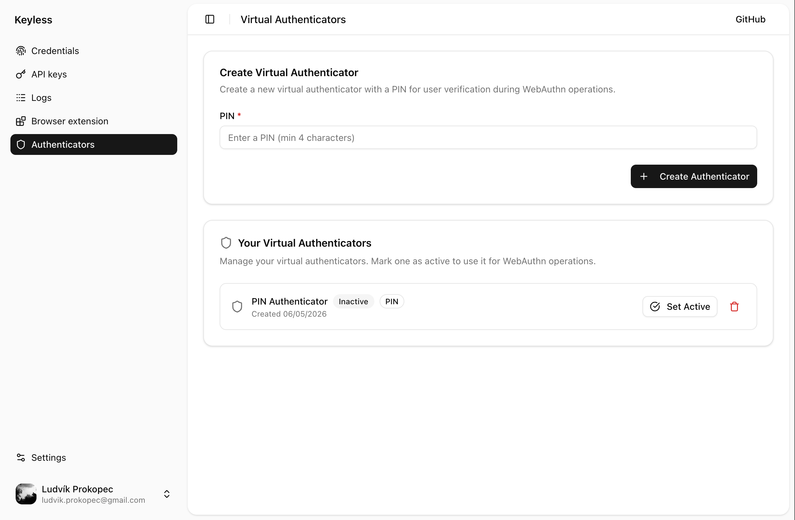
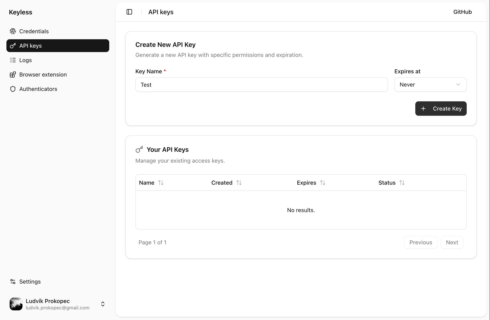
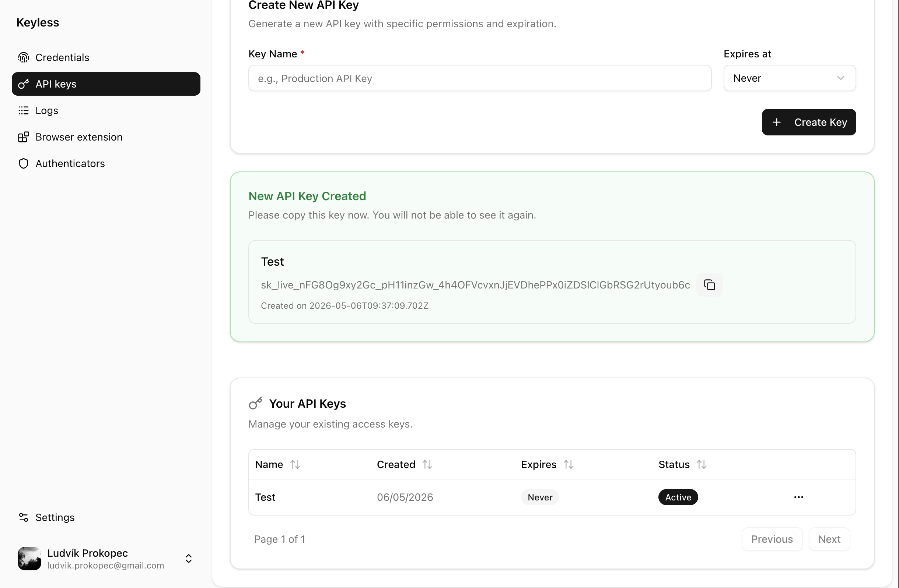
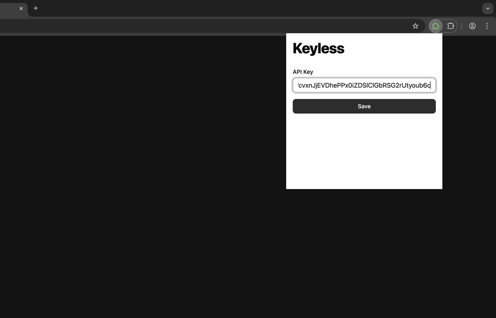
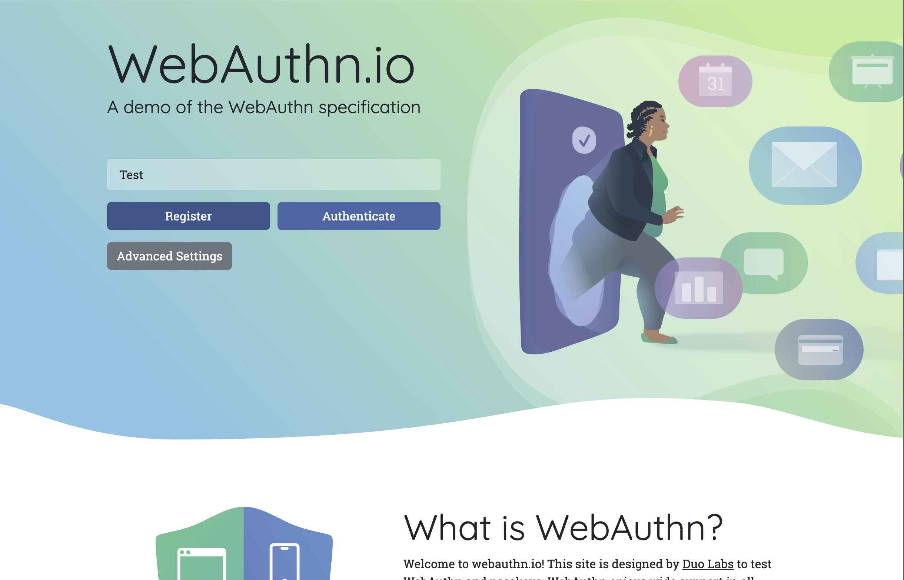

# How to start (development)

## Prerequisites

- Node.js 18+
- pnpm
- Docker + Docker Compose

## Steps

### 1) Install dependencies

```bash
pnpm install
```

### 2) Start infrastructure

```bash
./docker-compose-test.sh
```

### 3) Build packages and applications

```bash
pnpm build
```

### 4) Migrate database

```bash
pnpm --filter '@repo/prisma' db:migrate
```

### 5) Run in development mode

Start all services, excluding the example relying party app:

```bash
pnpm dev --filter '!@repo/nextjs-example'
```

And go to [http://localhost:3006](http://localhost:3006) to setup authenticator and API keys in Console application.

## Screens

### 1) Create virtual authenticator



### 2) Set authenticator active



### 3) Create API key



### 4) Copy created API key



### 5) Paste API key to extension



### 6) Test the authenticator


